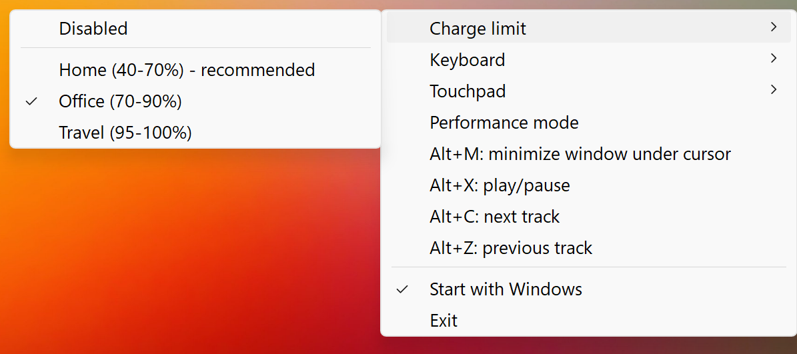

# Honor PC Helper

[Русский](README.ru.md) | [中文](README.zh.md)

A Windows system tray utility for managing HONOR laptop hardware features. Uses the official HONOR WMI interface.

## Features

- **Battery** — charge range limiter (extends battery lifespan)
- **Keyboard backlight** — on/off, timeout, and auto-enable schedule
- **Performance** — switch between balanced and performance mode
- **Monitoring** — view temperatures, fan speeds, and hardware settings in the tray tooltip
- **Touchpad** — haptic feedback strength, touchpad edge gestures (brightness on the left, volume on the right), adjust brightness by swiping the left edge
- **Hotkeys** — global shortcuts for window and media control, reassignable from the tray menu
- **Autostart** — launches with Windows
- **Interface languages** — Russian, English and Simplified Chinese, selected automatically by the Windows display language

## Screenshot



## Usage

Download `HonorPCHelper.exe` from the [latest release](https://github.com/Wintego/honor-pc-helper/releases/latest) and run it. No installation required.

The first time you change a hardware setting, Windows will ask for administrator privileges to create a scheduled task.

Requires **Windows x64**. Feature availability depends on the HONOR laptop model.

## Hotkeys

Defaults: `Alt+M` — minimize the window under the cursor, `Alt+X` — play/pause, `Alt+C` — next track, `Alt+Z` — previous track.

To change a shortcut, click the matching item in the tray menu and press the new combination. At least one modifier is required — Ctrl, Alt or Win. `Esc` cancels, `Del` disables the shortcut. Changes apply immediately and are stored in the registry; the "Reset shortcuts to defaults" item restores the original values.

If a combination is already taken by another application, a balloon tip reports it and the menu item is marked as "in use".

## Configuration

The settings file is optional. To override the defaults, create a `config.json` next to the exe:

```json
{
  "brightnessStepPercent": 5,
  "sensorRefreshIntervalMs": 5000,
  "touchpadBrightnessEnabled": true,
  "hotkeysEnabled": true
}
```

Changes take effect after restarting the application.

## Building from source

Requires [.NET 10 SDK](https://dotnet.microsoft.com/download/dotnet/10.0):

```powershell
.\build.ps1
```

The output file will be placed in `dist\HonorPCHelper.exe`.
