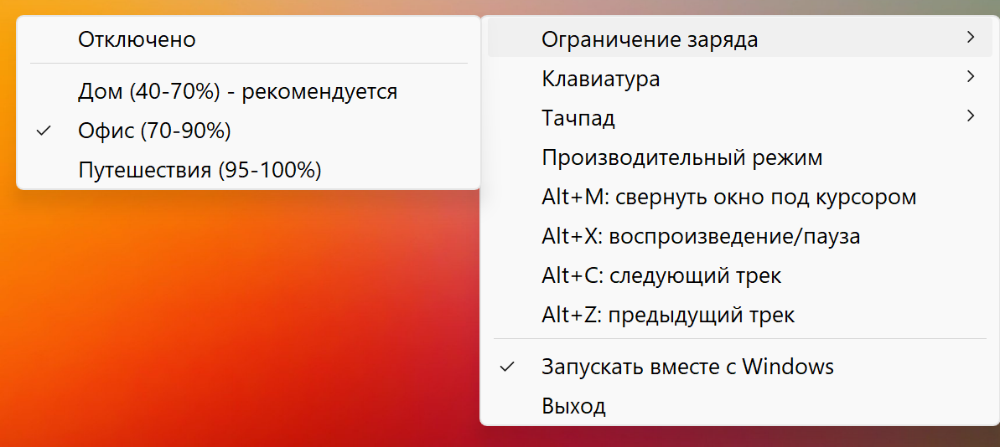

# Honor PC Helper

[English](README.md) | [中文](README.zh.md)

Windows-утилита для управления аппаратными функциями ноутбуков HONOR из системного трея. Использует фирменный WMI-интерфейс HONOR.

## Возможности

- **Батарея** — ограничение диапазона заряда (продлевает срок службы)
- **Подсветка клавиатуры** — включение/выключение, таймаут погасания, расписание автовключения
- **Производительность** — переключение между умным (balanced) и производительным режимом
- **Мониторинг** — отображение температур, оборотов вентиляторов и настроек в подсказке трея
- **Тачпад** — интенсивность виброотклика, жесты на краях тачпада (яркость слева, громкость справа), изменение яркости движением по левому краю
- **Горячие клавиши** — глобальные сочетания для окон и мультимедиа, переназначаются из меню трея
- **Автозапуск** — старт вместе с Windows
- **Языки интерфейса** — русский, английский и упрощённый китайский, выбираются автоматически по языку Windows

## Скриншот



## Использование

Скачайте `HonorPCHelper.exe` из [последнего релиза](https://github.com/Wintego/honor-pc-helper/releases/latest) и запустите. Установка не требуется.

При первом изменении аппаратной настройки Windows запросит права администратора для создания служебной задачи.

Приложение рассчитано на **Windows x64**. Доступность функций зависит от модели ноутбука HONOR.

## Горячие клавиши

По умолчанию: `Alt+M` — свернуть окно под курсором, `Alt+X` — воспроизведение/пауза, `Alt+C` — следующий трек, `Alt+Z` — предыдущий трек.

Чтобы изменить сочетание, кликните по нужному пункту в меню трея и нажмите новую комбинацию. Нужен хотя бы один модификатор — Ctrl, Alt или Win. `Esc` отменяет ввод, `Del` отключает сочетание. Изменения применяются сразу и сохраняются в реестре; пункт «Сбросить сочетания по умолчанию» возвращает исходные значения.

Если комбинация занята другим приложением, приложение сообщит об этом всплывающей подсказкой, а пункт меню будет помечен как «занято».

## Настройка

Файл настроек необязателен. Чтобы изменить значения по умолчанию, создайте `config.json` рядом с exe:

```json
{
  "brightnessStepPercent": 5,
  "sensorRefreshIntervalMs": 5000,
  "touchpadBrightnessEnabled": true,
  "hotkeysEnabled": true
}
```

Изменения применяются после перезапуска приложения.

## Сборка из исходников

Требуется [.NET 10 SDK](https://dotnet.microsoft.com/download/dotnet/10.0):

```powershell
.\build.ps1
```

Готовый файл появится в `dist\HonorPCHelper.exe`.
